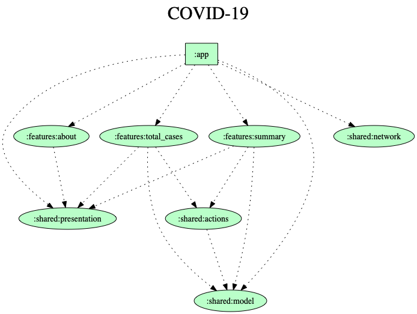

# COVID-19 Cases
[](https://kotlinlang.org)

COVID-19 Cases app showes the cases by country powered by the Center for Systems Science and Engineering (CSSE) at Johns Hopkins University (JHU).

## Features
<ul>
<li>Show the country list with the confirmed cases</li>
<li>Show the country cases details</li>
</ul>

<p align="center">
  
</p>

## Tech-stack
This project uses the popular libraries and tools from the Android ecosystem.
- Tech-stack
    - [Kotlin](https://kotlinlang.org/)
    - Androidx
    - [Retrofit](https://square.github.io/retrofit/) networking 
    - [Dagger](https://dagger.dev/android.html) dependency injection
    - [RxAndroid](https://github.com/ReactiveX/RxAndroid) reactive components
- Architecture
    - MVP
    - [Clean Architecture](https://proandroiddev.com/kotlin-clean-architecture-1ad42fcd97fa)
- Tests
    - [Unit Tests](https://en.wikipedia.org/wiki/Unit_testing)
    - [Mockito](https://github.com/mockito/mockito) 
    - [Mockito-Kotlin](https://github.com/nhaarman/mockito-kotlin)
    
## Modularization
The app is modularized. We can see the dependency graph with all the modules.
<p align="center">
  
</p>

## Licence
```
Copyright (c) 2020 Marcus Pimenta

Licensed under the Apache License, Version 2.0 (the "License");
you may not use this file except in compliance with the License.
You may obtain a copy of the License at

http://www.apache.org/licenses/LICENSE-2.0

Unless required by applicable law or agreed to in writing, software
distributed under the License is distributed on an "AS IS" BASIS,
WITHOUT WARRANTIES OR CONDITIONS OF ANY KIND, either express or implied.
See the License for the specific language governing permissions and
limitations under the License.
```
